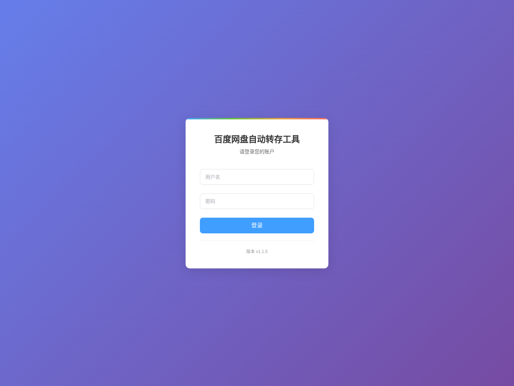
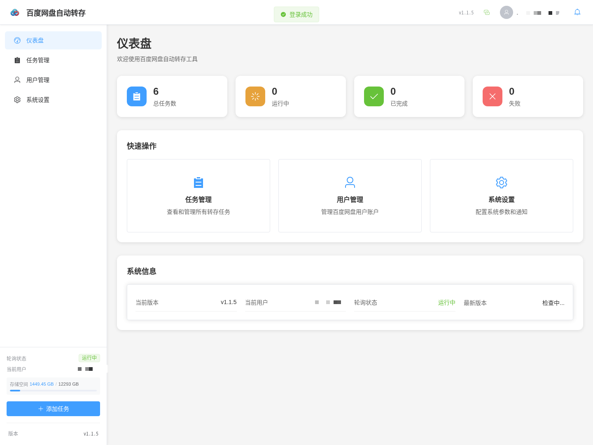
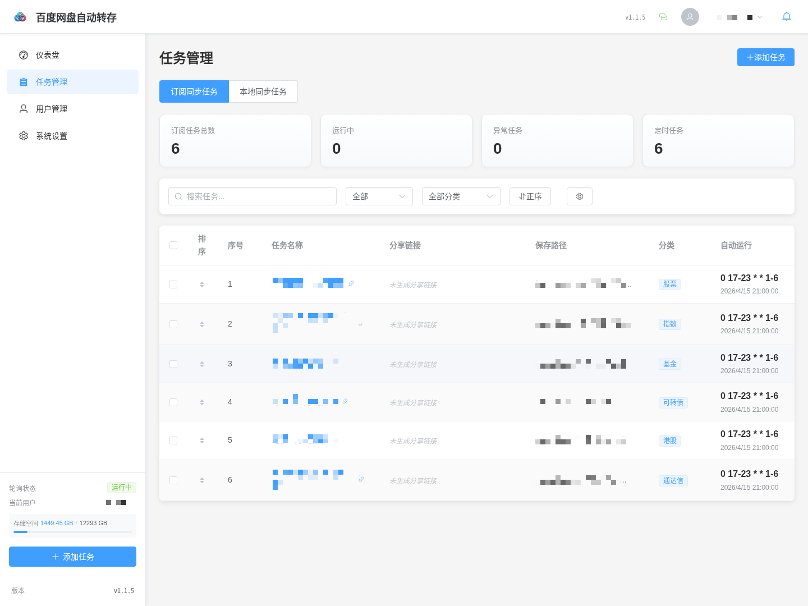
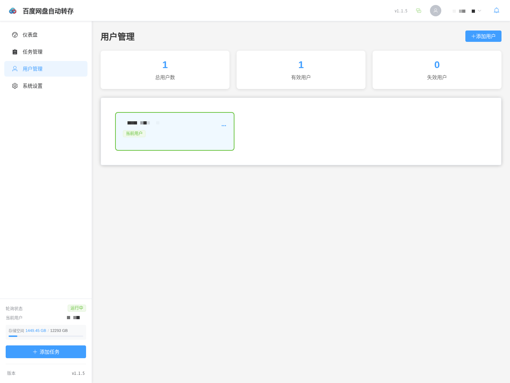
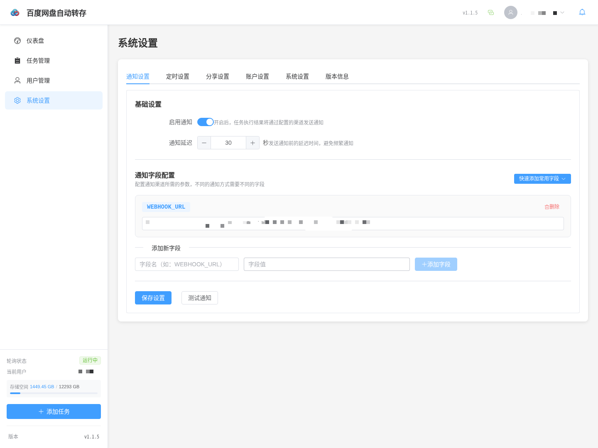

# 百度网盘同步

> **当前维护声明**：本仓库基于原作者项目继续扩展和维护，当前重点是稳定打通“订阅链接 -> 百度网盘应用目录 -> 本地目录”的全链路。项目会持续迭代，也欢迎更多人一起提交 Issue 和 PR，协助维护、排查问题和补齐文档。
>
> **致谢与来源**：本项目基于 kokojacket 的原项目继续演进，原项目地址：<https://github.com/kokojacket/baidu-autosave>。感谢原作者提供的基础能力与开源贡献。

这是一个围绕百度网盘构建的数据同步项目，在原有自动转存能力的基础上，补齐了订阅更新、本地同步和前端管理中台之间的链路。现在可以把分享或订阅内容先同步到百度网盘，再按策略同步到本地目录，并在统一界面里管理用户、任务、通知和运行状态。

当前核心目标有三件事：

1. 订阅内容自动更新并同步到百度网盘
2. 百度网盘数据按策略同步到本地目录
3. 提供前端管理中台统一管理用户、任务和同步状态

## 维护说明

- 当前仓库以可用性和稳定性为优先，重点维护“订阅链接 -> 百度网盘 -> 本地目录”的整条链路。
- 发现问题、边界场景或兼容性差异时，欢迎直接提交 Issue、讨论或 PR。
- 文档、测试、运维脚本和前端体验优化同样欢迎共同维护。

## 主要特性

- 🔄 订阅同步：支持按全量/增量、时间范围、覆盖范围执行百度网盘订阅同步
- 👥 多用户管理：支持添加多个百度网盘账号
- ⏰ 定时任务：支持全局定时和单任务定时规则
- 📱 消息推送：支持25+种通知方式和自定义WEBHOOK
- 🎯 任务分类：支持对任务进行分类管理
- 📊 状态监控：实时显示任务执行状态和进度
- 🔍 智能去重：自动跳过已转存的文件
- 🗂️ 本地同步面板：可在设置页直接启动、停止、查看百度网盘到本地的同步状态与日志
- 💾 容量监控：监控网盘容量并在超过阈值时发送通知
- 📋 链接复制：支持一键复制分享链接到剪贴板
- 🤖 智能填充：自动获取分享链接的文件夹名称并填充任务名称
- 🔍 正则处理：支持在增量模式下按正则过滤和重命名同步文件
- 🎨 美观界面：响应式设计，支持移动端访问

## 页面展示

下面的页面截图可通过前端自动截图脚本重新生成，默认访问 `http://127.0.0.1:3001`；登录账号和密码请通过环境变量传入，避免把本地凭据写进仓库。











前端自动截图工具当前推荐使用 Playwright，原因是它对登录态保持、路由跳转、等待异步渲染完成和批量导出页面截图都更稳定。生成方式如下：

```bash
cd frontend
npm run screenshots
```

如需生成登录后的管理页截图，请显式传入登录信息：

```bash
cd frontend
SCREENSHOT_BASE_URL=http://127.0.0.1:3001 \
SCREENSHOT_USERNAME=your-username \
SCREENSHOT_PASSWORD='your-password' \
npm run screenshots
```

## 系统要求

- Python 3.10（baidupcs-py-0.7.6只支持3.10）
- Windows/Linux/MacOS

## 通信模式

当前项目统一使用轮询模式：前端定期向后端请求最新任务状态、日志和配置。

这样做的原因是实现更简单、部署更稳定，也更适合现在这个“订阅转存 + 百度网盘本地同步 + 管理中台”的整体目标。

## 订阅同步语义

订阅任务和本地 bypy 同步是两套独立流程。

- 订阅任务手工执行、定时执行，走的是分享链接访问和转存流程，核心逻辑在 `backend/storage.py`。
- 本地同步面板走的是 `backend/bypy_sync/`，用于把百度网盘内容同步到本地目录。

订阅任务中的“增量更新”和“全量同步”含义如下：

- `增量更新`：先扫描分享内容，再结合时间范围、已存在文件、正则过滤和重命名规则决定需要处理的文件。
- `全量同步`：同样会先扫描分享内容，但会关闭正则过滤和重命名规则，按所选时间范围直接处理目标内容。
- 这两个选项不会切换到本地 bypy 增量同步引擎，只影响订阅转存阶段的筛选、覆盖和后处理策略。

订阅任务中的“更新时间范围”和“日期目录格式”行为如下：

- 当能识别出日期目录时，系统会优先按日期目录做范围裁剪，例如最近 N 个月或指定月份区间。
- 自动识别默认支持 `YYYY-MM`、`YYYY-M`、`YYYYMM`、`YYYY年MM月`、`YYYY/MM`、`按月归档/YYYY-MM`、`按月归档/YYYY年MM月` 等常见结构。
- 当目录结构无法匹配任何可识别日期格式时，系统会自动回退为该任务范围内的全量处理，避免因为日期识别失败漏同步。
- 如果目录结构可以识别，但当前时间范围内没有命中任何月份目录，则这次任务会直接跳过，不会回退成全量扫描。

## 安装说明

1. 克隆仓库：
```bash
git clone https://github.com/ShaoDinglun/baidu-sync.git
cd baidu-sync
```

2. 安装依赖：
```bash
pip install -r requirements.txt
```

3. 运行应用：
```bash
python -m backend.web_app
```

4. 访问 Web 界面：

- 后端管理中台：`http://localhost:5000`
- 前端开发服务：`http://localhost:3001`

### 启动方式

开发时最直接的方式是分两个终端分别启动后端和前端。

方式一：两个终端窗口

```bash
# 终端 1：项目根目录启动后端
cd /path/to/baidu-sync
python -m backend.web_app

# 终端 2：frontend 目录启动前端
cd /path/to/baidu-sync/frontend
npm install
npm run dev
```

看到以下地址通常表示启动成功：

- 后端：`http://0.0.0.0:5000` 或 `http://127.0.0.1:5000`
- 前端：`http://localhost:3001`

方式二：统一后台管理脚本（Linux/macOS）

项目提供了一个后台管理脚本 `scripts/manage_services.sh`，可在仓库根目录统一管理前后端：

```bash
chmod +x scripts/manage_services.sh
./scripts/manage_services.sh start
./scripts/manage_services.sh status
./scripts/manage_services.sh stop
```

也可以单独管理前端或后端：

```bash
./scripts/manage_services.sh start backend
./scripts/manage_services.sh stop backend
./scripts/manage_services.sh restart frontend
./scripts/manage_services.sh status frontend
```

脚本行为说明：

- 后端在项目根目录执行 `python -m backend.web_app`
- 前端在 `frontend/` 目录执行 `npm run dev`
- 如果 `frontend/node_modules` 不存在，会自动执行 `npm install`
- 后端日志按日期切分写入 `log/backend.YYYY-MM-DD.out.log`

方式三：Docker

```bash
docker-compose up --build

# 或后台运行
docker-compose up -d
```

### 运行排查

检查端口：

```bash
# 后端 5000
lsof -i :5000

# 前端 3001
lsof -i :3001
```

如果系统没有 `lsof`，也可以使用：

```bash
netstat -tlnp | grep :5000
netstat -tlnp | grep :3001
```

查看日志：

```bash
# 后端日志
tail -f log/backend.$(date +%F).out.log

# 前端日志
tail -f log/frontend.out.log
```

停止服务：

```bash
# 前台运行时直接 Ctrl+C

# 如需强制结束端口进程
lsof -ti:5000 | xargs kill -9
lsof -ti:3001 | xargs kill -9
```


## 项目边界

当前项目明确只覆盖下面这几条链路：

- 订阅同步：分享链接内容 -> 百度网盘应用目录。
- 本地同步：百度网盘应用目录 -> 本地目录。
- 管理中台：统一管理用户、订阅任务、本地同步任务、日志和通知配置。

当前不做下面这些能力：

- 不把订阅任务直接同步到本地目录；订阅同步和本地同步始终是两套独立流程。
- 不做本地目录到百度网盘的反向上传，也不做双向同步。
- 不做严格镜像；本地同步默认只补缺、更新，不自动删除本地多余文件。
- 不使用 WebSocket；前端实时状态统一靠轮询接口获取。
- 不把“订阅任务的增量/全量”切换成本地 bypy 引擎；订阅任务里的这些选项只影响分享扫描、范围筛选、覆盖和后处理。

### 平台内管理本地同步

启动前后端后，可以在管理中台的“任务管理”页面进入本地同步相关功能。

“任务管理”页面负责维护任务：

- 新增、编辑、删除本地同步任务。
- 为每个任务单独配置远程根目录、本地目录、启用状态、增量范围和覆盖策略。
- 在单任务维度执行增量同步并查看该任务日志。

同一页面中还可以直接进行运行控制：

- 查看增量同步和全量补缺的当前状态。
- 按任务筛选需要执行的本地同步任务。
- 以 Dry Run 方式先预演，再决定是否正式执行。
- 启动或停止增量同步。
- 启动或停止全量补缺同步。
- 查看最近日志输出。

本地同步现在会复用主配置 `config/config.json` 中的通知设置；正式执行完成后会发送结果通知，Dry Run 不发送通知。

本地同步统一通过 Python 模块执行：

- 增量同步：`python -m backend.bypy_sync.incremental_sync`
- 全量补缺：`python -m backend.bypy_sync.full_sync`

中台里的“执行单个本地同步任务”当前也是走增量同步引擎，只是会把任务过滤到单个任务名；“全量补缺”仍然是单独的运行入口，不是每个任务各自切换的另一种按钮模式。

执行方式如下：

- 中台按钮 -> `backend.web_app` 内原生线程任务。
- 命令行或 cron -> 直接执行 Python 模块。

当前平台接入的后端接口为：

- `GET /api/local-sync/status`
- `GET /api/local-sync/tasks`
- `POST /api/local-sync/tasks/save`
- `POST /api/local-sync/tasks/delete`
- `POST /api/local-sync/tasks/run`
- `GET /api/local-sync/directories`
- `POST /api/local-sync/start`
- `POST /api/local-sync/stop`
- `GET /api/local-sync/logs`
- `GET /api/local-sync/tasks/logs`

默认建议先使用 Dry Run 验证任务筛选和日志输出是否符合预期，再执行正式同步。

`config/bypy_sync.json` 中的本地同步任务现在支持 `task_id`、`directory_filters`、`sync_mode`、`recent_value` 和 `overwrite_policy` 字段。

- `directory_filters`：远程根目录下允许同步的相对目录列表。
- `sync_mode`：`all`、`manual`、`recent_days`、`recent_months`。
- `recent_value`：最近 N 天或最近 N 月的窗口值。
- `overwrite_policy`：`never`、`if_newer`、`always`。

本地同步核心代码位于 `backend/bypy_sync/` 子包；`scripts/` 目录用于前后端运维。

### 本地同步配置与运行

本地同步统一使用运行时配置文件 `config/bypy_sync.json`。

如果该文件不存在，Web 端本地同步入口和命令行工具都会自动用 `config/bypy_sync.example.json` 初始化它。因此仓库里只需要保留示例文件，本机环境保留生成后的运行时文件即可。

默认模板示例：

```json
{
  "bypy": {
    "binary": "bypy",
    "config_dir": "/app/config/.bypy",
    "retry_times": 3,
    "retry_delay_seconds": 5,
    "retry_backoff": 2,
    "network_timeout": 300,
    "command_timeout": 0,
    "command_heartbeat_seconds": 15,
    "min_command_interval_seconds": 1.0,
    "processes": 1,
    "verify_download": false,
    "log_dir": "log/bypy_sync",
    "summary_file": "log/bypy_sync/last_run.json",
    "lock_file": "log/bypy_sync/bypy_full_sync.lock",
    "state_file": "log/bypy_sync/current_state.json"
  },
  "tasks": [
    {
      "task_id": "example-recent-task",
      "name": "示例任务：最近两个月同步",
      "enabled": true,
      "auto_run_enabled": true,
      "cron": "15 * * * *",
      "remote_root": "/示例目录",
      "local_root": "/app/data/example-recent-task",
      "sync_mode": "recent_months",
      "recent_value": 2,
      "overwrite_policy": "if_newer",
      "directory_filters": []
    }
  ]
}
```
```

说明：

- `remote_root` 建议始终使用 bypy 应用目录下路径，也就是以 `/` 开头。
- `enabled=true` 的任务才会参与执行。
- `auto_run_enabled + cron` 用于中台内自动调度。
- `directory_filters` 表示远程根目录下允许同步的相对目录列表；为空时表示整个根目录。
- Docker 部署时建议 `config_dir` 使用 `/app/config/.bypy`，`local_root` 使用 `/app/data/...`；宿主机直接运行时请改成你自己的实际目录。

`sync_mode` 支持 4 种模式：

- `all`：同步整个文件夹。
- `manual`：手动指定 `directory_filters` 中的子目录。
- `recent_days`：递归识别日期目录，只同步最近 n 天，对应 `recent_value`。
- `recent_months`：递归识别日期目录，只同步最近 n 月，对应 `recent_value`。

本地同步任务还支持 `overwrite_policy`：

- `never`：本地已有文件时不覆盖。
- `if_newer`：仅当远端文件较新或大小变化时覆盖。
- `always`：本地已有文件时始终覆盖。

当 `recent_days` / `recent_months` 在整棵远程目录树里完全识别不到任何日期目录时，会自动回退为整个文件夹同步；如果识别到了日期目录但都不在配置范围内，则会跳过该任务。

当前自动识别的日期目录名包括：

- `2026-04`
- `202604`
- `2026-04-13`
- `20260413`
- `2026年04月`
- `2026年04月13日`

命令行示例：

```bash
# 增量同步 dry-run
python -m backend.bypy_sync.incremental_sync --config config/bypy_sync.json --dry-run

# 增量同步正式执行
python -m backend.bypy_sync.incremental_sync --config config/bypy_sync.json

# 增量同步只执行指定任务
python -m backend.bypy_sync.incremental_sync --config config/bypy_sync.json --task "A股数据分笔数据全量拉取"

# 全量补缺 dry-run
python -m backend.bypy_sync.full_sync --config config/bypy_sync.json --dry-run

# 全量补缺正式执行
python -m backend.bypy_sync.full_sync --config config/bypy_sync.json

# 全量补缺只执行指定任务
python -m backend.bypy_sync.full_sync --config config/bypy_sync.json --task "A股数据全量拉取"
```

如果使用项目虚拟环境，可直接写完整命令：

```bash
"${PWD}/.venv/bin/python" -m backend.bypy_sync.incremental_sync --config "${PWD}/config/bypy_sync.json"
"${PWD}/.venv/bin/python" -m backend.bypy_sync.full_sync --config "${PWD}/config/bypy_sync.json"
```

cron 示例：

```bash
# 每天凌晨 1:15 执行一次增量同步
15 1 * * * cd /path/to/baidu-sync && /path/to/baidu-sync/.venv/bin/python -m backend.bypy_sync.incremental_sync --config config/bypy_sync.json >> /path/to/baidu-sync/log/bypy_sync/cron_incremental.log 2>&1

# 每 30 分钟执行一个指定任务的增量同步
*/30 * * * * cd /path/to/baidu-sync && /path/to/baidu-sync/.venv/bin/python -m backend.bypy_sync.incremental_sync --config config/bypy_sync.json --task "示例任务：最近两个月同步" >> /path/to/baidu-sync/log/bypy_sync/cron_incremental.log 2>&1
```

日志与状态文件：

- 增量同步日志：`log/bypy_sync/bypy_incremental_sync_YYYYMMDD_HHMMSS.log`
- 增量同步汇总：`log/bypy_sync/bypy_incremental_last_run.txt`
- 增量同步锁文件：`log/bypy_sync/bypy_incremental_sync.lock`
- 全量补缺日志：`log/bypy_sync/bypy_full_sync_YYYYMMDD_HHMMSS.log`
- 全量补缺最近汇总：`log/bypy_sync/last_run.json`
- 全量补缺状态文件：`log/bypy_sync/current_state.json`
- 全量补缺锁文件：`log/bypy_sync/bypy_full_sync.lock`

查看最近日志的常用方式：

```bash
tail -f "$(ls -t log/bypy_sync/bypy_full_sync_*.log | head -n 1)"
tail -f "$(ls -t log/bypy_sync/bypy_incremental_sync_*.log | head -n 1)"
```

行为边界说明：

- 增量同步用于补缺失和更新变化文件，不做严格镜像。
- 全量补缺用于首轮落地或补齐本地漏拉目录，也不是严格镜像。
- 默认不删除本地多余文件。
- 全量补缺默认不覆盖本地已有文件，也不做内容比对。
- 增量同步主要依据文件是否存在、文件大小和修改时间判断是否更新，不校验哈希。
- 为了稳定性，默认倾向单进程串行执行，而不是追求吞吐。
- 如果从中台触发，停止动作由后端原生任务控制；如果从命令行前台触发，直接 `Ctrl+C` 即可。

## Docker 部署

### 使用 docker-compose 部署（推荐）

1. 创建 `docker-compose.yml` 文件：
```yaml
services:
  baidu-sync:
    build:
      context: .
      dockerfile: Dockerfile
    image: baidu-sync:local
    container_name: baidu-sync
    restart: unless-stopped
    ports:
      - "5000:5000"
    volumes:
      - ./config:/app/config
      - ./log:/app/log
      - ./data:/app/data
    environment:
      - TZ=Asia/Shanghai
      - BAIDU_AUTOSAVE_DEFAULT_PASSWORD=change-this-password
```

2. 创建必要目录：
```bash
mkdir -p config log
```

3. 启动服务：
```bash
docker-compose up -d --build
```

4. 查看日志：
```bash
docker-compose logs -f
```

5. 访问Web界面：
```
http://localhost:5000
```

> 默认登录账号：admin  
> 如果 `config/config.json` 中未配置 `auth.password`，首次启动会自动生成随机初始密码并写入配置文件，同时输出到启动日志。  
> 如需固定初始密码，可通过环境变量 `BAIDU_AUTOSAVE_DEFAULT_PASSWORD` 显式指定。

> 如果 `config/bypy_sync.json` 不存在，首次进入本地同步页面或首次执行 bypy CLI 时，会自动从 `config/bypy_sync.example.json` 复制生成本地运行时配置。

### 使用 Docker CLI 部署

1. 创建必要目录：
```bash
mkdir -p config log data
```

2. 构建镜像：
```bash
docker build -t baidu-sync:local .
```

3. 启动容器：
```bash
docker run -d \
  --name baidu-sync \
  --restart unless-stopped \
  -p 5000:5000 \
  -v $(pwd)/config:/app/config \
  -v $(pwd)/log:/app/log \
  -v $(pwd)/data:/app/data \
  -e TZ=Asia/Shanghai \
  -e BAIDU_AUTOSAVE_DEFAULT_PASSWORD=change-this-password \
  baidu-sync:local
```

4. 查看日志：
```bash
docker logs -f baidu-sync
```

5. 访问Web界面：
```
http://localhost:5000
```
> 默认登录账号：admin  
> 如果 `config/config.json` 中未配置 `auth.password`，首次启动会自动生成随机初始密码并写入配置文件，同时输出到启动日志。  
> 如需固定初始密码，可通过环境变量 `BAIDU_AUTOSAVE_DEFAULT_PASSWORD` 显式指定。

### 目录结构说明

```
baidu-sync/
├── config/                       # 配置文件目录
│   ├── config.json              # 运行时配置文件（自动生成）
│   ├── config.template.json     # 主配置模板
│   ├── bypy_sync.example.json   # bypy 本地同步任务示例模板
│   └── bypy_sync.json           # bypy 运行时配置文件（自动生成，本地保留）
├── backend/                      # Flask 后端源码包
│   ├── web_app.py               # Flask Web API 入口
│   ├── storage.py               # 百度网盘转存与同步核心逻辑
│   ├── scheduler.py             # 定时任务调度
│   ├── notify.py                # 消息通知
│   ├── utils.py                 # 公共工具函数
│   └── bypy_sync/               # 百度网盘到本地同步子包
│       ├── __init__.py          # 本地同步包入口
│       ├── incremental_sync.py  # 增量同步核心实现
│       └── full_sync.py         # 全量补缺核心实现
├── frontend/                     # Vue 3 管理中台
│   ├── src/                     # 前端源码
│   └── package.json             # 前端依赖和脚本
├── data/                         # 本地敏感或临时数据目录（默认不提交）
│   └── cookies.txt              # 手工导出的 cookies 备份
├── docs/                         # 辅助文档
├── scripts/                      # 运维脚本
│   └── manage_services.sh       # 前后端启停脚本
├── log/                          # 运行日志目录
├── Dockerfile                   # Docker 构建文件
├── docker-compose.yml           # Docker Compose 配置
└── requirements.txt             # Python 依赖
```

### 主要模块说明

- **backend/web_app.py**: Web应用核心，提供认证、任务、用户和配置相关的 HTTP API
- **backend/storage.py**: 管理百度网盘API调用和数据存储
- **backend/scheduler.py**: 处理定时任务的调度和执行
- **backend/notify.py**: 实现各种通知方式
- **backend/utils.py**: 提供通用工具函数

## 使用说明

### 1. 添加用户

1. 登录百度网盘网页版
2. 按F12打开开发者工具获取cookies
3. 在系统中添加用户，填入cookies

### 2. 添加任务

1. 点击"添加任务"按钮
2. 填写任务信息：
   - 任务名称（可选，支持自动获取分享链接的文件夹名称）
   - 分享链接（必填，输入完成后会自动获取文件夹名称）
   - 保存目录（必填，会根据任务名称智能同步）
   - 定时规则（可选）
   - 分类（可选）
  - 更新方式（必填，可选“全量同步”或“增量更新”）
  - 更新时间范围（必填，可选全部、最近 N 个月、指定月份区间）
  - 覆盖范围（必填，可选不覆盖、仅覆盖时间范围内文件、始终覆盖）
  - 日期目录格式（必填，可选自动识别或自定义目录格式）
  - 过滤表达式（可选，仅增量模式生效，用于筛选需要同步的文件）
  - 重命名表达式（可选，仅增量模式生效，用于重命名同步后的文件）

**智能功能说明：**
- **自动填充任务名称**：输入分享链接后，系统会自动获取分享内容的文件夹名称并填充到任务名称
- **保存目录同步**：任务名称变化时会自动更新保存目录的最后一级文件夹名
- **编辑检测**：一旦手动编辑保存目录，当前任务将停止自动同步；新建任务时重新启用
- **分享链接复制**：任务创建后，可在任务列表中一键复制分享链接
- **自动识别日期目录**：默认会识别常见按日、按月目录结构，并按时间范围筛选目录内容
- **自定义日期目录格式**：当分享目录命名不规则时，可手动配置目录格式表达式匹配日期目录；如果仍然无法匹配到任何日期目录，本次订阅任务会自动回退为全量处理
- **范围化覆盖策略**：可以只覆盖选定时间范围内的文件，避免误改历史归档
- **增量正则处理**：使用正则表达式筛选和重命名增量文件，如 `^(\d+)\.mp4$` 或 `第\1集.mp4`
- **全量模式说明**：全量同步会按时间范围直接扫描并同步目标目录，此时不会执行正则过滤和重命名规则；它仍然属于订阅转存流程，不会切换到本地 bypy 同步

**⚠️ 重命名功能注意事项：**
百度网盘API对重命名操作有严格的频率限制，频繁重命名可能导致失败或触发风控。建议优先通过调整分享源文件名来满足需求，谨慎使用重命名功能。

### 3. 定时设置

- 全局定时规则：适用于所有未设置自定义定时的任务
- 单任务定时：可为每个任务设置独立的定时规则
- 定时规则使用cron表达式，例如：
  - `*/5 * * * *` : 每5分钟执行一次
  - `0 */1 * * *` : 每小时执行一次
  - `0 8,12,18 * * *` : 每天8点、12点、18点执行

### 4. 通知设置

系统支持25+种通知方式，包括但不限于：
- **PushPlus**: 访问 [pushplus.plus](http://www.pushplus.plus) 获取Token
- **Bark**: iOS平台推送服务
- **钉钉机器人**: 企业钉钉群组通知
- **飞书机器人**: 企业飞书群组通知
- **企业微信**: 企业微信应用和机器人推送
- **Telegram**: Telegram机器人推送
- **SMTP邮件**: 支持各种邮件服务商
- **自定义WEBHOOK**: 支持任意HTTP接口推送
- **其他**: Gotify、iGot、ServerJ、PushDeer等

**配置方法：**
1. 在系统设置的"通知设置"部分启用通知功能
2. 添加对应通知服务的字段配置（如`PUSH_PLUS_TOKEN`）
3. 对于WEBHOOK配置，支持快速添加和简化输入格式
4. 点击"测试通知"验证配置是否正确
5. 支持同时配置多种通知方式

**WEBHOOK配置说明：**
- 系统提供"添加WEBHOOK配置"按钮，可一键添加所有必需的WEBHOOK字段
- WEBHOOK_BODY字段支持简化输入格式：`title: "$title"content: "$content"source: "项目名"`
- 保存时系统会自动转换为标准多行格式，无需手动处理换行符和转义
- 支持自定义HTTP方法、请求头和请求体格式

**通知延迟合并功能：**
1. 当多个任务在短时间内执行完成时，系统会将通知合并为一条发送
2. 可在系统设置页面的"通知设置"部分设置通知延迟时间（默认30秒）
3. 延迟时间越长，越有可能将更多任务的通知合并在一起
4. 这有助于减少频繁的通知推送，提高用户体验

### 5. 网盘容量监控

系统支持自动监控网盘容量并在超过阈值时发送通知：
1. 在系统设置中启用"网盘容量提醒"
2. 设置容量提醒阈值（默认90%）
3. 设置检查时间（默认每天00:00）
4. 当网盘使用量超过设定阈值时，系统将通过已配置的通知渠道发送警告

## 配置文件说明

`config.json` 包含以下主要配置（示例）：

```json
{
    "baidu": {
        "users": {},          // 用户信息
        "current_user": "",   // 当前用户
        "tasks": []          // 任务列表
    },
    "retry": {
        "max_attempts": 3,    // 最大重试次数
        "delay_seconds": 5    // 重试间隔
    },
    "cron": {
        "default_schedule": [   // 默认定时规则，支持多个 cron 表达式
            "0 10 * * *"
        ],
        "auto_install": true    // 自动启动定时
    },
    "notify": {
        "enabled": true,      // 启用通知
        "notification_delay": 30, // 通知延迟合并时间（秒），设置为0禁用合并
        "direct_fields": {     // 直接映射到通知库的字段（推荐）
            "PUSH_PLUS_TOKEN": "",        // PushPlus Token
            "PUSH_PLUS_USER": "",         // PushPlus 群组编码（可选）
            "BARK_PUSH": "",              // Bark 推送地址或设备码
            "DD_BOT_TOKEN": "",           // 钉钉机器人 Token
            "DD_BOT_SECRET": "",          // 钉钉机器人 Secret
            "TG_BOT_TOKEN": "",           // Telegram 机器人 Token
            "TG_USER_ID": "",             // Telegram 用户 ID
            "SMTP_SERVER": "",            // SMTP 服务器地址
            "SMTP_EMAIL": "",             // SMTP 发件邮箱
            "SMTP_PASSWORD": "",          // SMTP 登录密码
            "WEBHOOK_URL": "",            // 自定义 Webhook 地址
            "WEBHOOK_METHOD": "POST",     // 自定义 Webhook 请求方法
            "WEBHOOK_CONTENT_TYPE": "application/json", // 请求内容类型
            "WEBHOOK_HEADERS": "Content-Type: application/json", // 请求头
            "WEBHOOK_BODY": "title: \"$title\"\ncontent: \"$content\"\nsource: \"项目名\"" // 请求体格式
        },
        "custom_fields": {     // 自定义字段，可通过界面动态添加
        }
        // 兼容旧格式：也支持 { "channels": { "pushplus": { "token": "", "topic": "" } } }
    },
    "quota_alert": {
        "enabled": true,      // 是否启用容量提醒
        "threshold_percent": 90, // 容量提醒阈值百分比
        "check_schedule": "0 0 * * *" // 检查时间（默认每天00:00）
    },
    "scheduler": {
        "max_workers": 1,     // 最大工作线程数
        "misfire_grace_time": 3600,  // 错过执行的容错时间
        "coalesce": true,     // 合并执行错过的任务
        "max_instances": 1    // 同一任务的最大并发实例数
    }
}
```

## 常见问题

1. **任务执行失败**
   - 检查分享链接是否有效
   - 确认账号登录状态
   - 查看错误日志了解详细原因

2. **定时任务不执行**
   - 确认定时规则格式正确
   - 检查系统时间是否准确
   - 查看调度器日志

3. **通知推送失败**
   - 验证通知服务的Token/配置是否正确（如PushPlus Token、Bark设备码等）
   - 使用"测试通知"功能验证配置
   - 检查网络连接和防火墙设置
   - 查看日志了解具体错误信息

4. **WEBHOOK配置问题**
   - 使用"添加WEBHOOK配置"按钮可自动添加所有必需字段
   - WEBHOOK_BODY支持简化格式输入，系统会自动转换
   - 确认目标服务器能正常接收JSON格式的POST请求
   - 检查WEBHOOK_URL地址是否可访问
   - 验证WEBHOOK_HEADERS配置是否符合目标服务器要求

5. **通知未合并**
   - 确认通知延迟时间设置合理（默认30秒）
   - 检查任务执行时间间隔是否超过了设定的延迟时间
   - 容量警告等重要通知不会被合并，会立即发送

6. **正则表达式使用问题**
   - 确认正则表达式语法正确，可使用在线正则测试工具验证
   - 过滤表达式用于筛选文件，重命名表达式用于文件重命名
   - 重命名功能可能因频率限制失败，建议谨慎使用
   - 示例：过滤 `\.mp4$` 只转存mp4文件，重命名 `(.+)\.mp4$` → `\1_renamed.mp4`

## 开发说明

### 主要模块说明

- **backend/web_app.py**: Web应用核心，提供认证、任务、用户和配置相关的 HTTP API
- **backend/storage.py**: 管理百度网盘API调用和数据存储
- **backend/scheduler.py**: 处理定时任务的调度和执行
- **backend/notify.py**: 实现各种通知方式
- **backend/utils.py**: 提供通用工具函数

## 许可证

MIT License

## 致谢

- [baidu-autosave](https://github.com/kokojacket/baidu-autosave.git) - 感谢原作者提供项目基础和最初的实现思路，让这个仓库可以在现有成果上继续演进。
- [Flask](https://flask.palletsprojects.com/)
- [APScheduler](https://apscheduler.readthedocs.io/)
- [baidupcs-py](https://github.com/PeterDing/BaiduPCS-Py)
- [quark-auto-save](https://github.com/Cp0204/quark-auto-save) - 夸克网盘自动转存项目，提供了很好的参考
